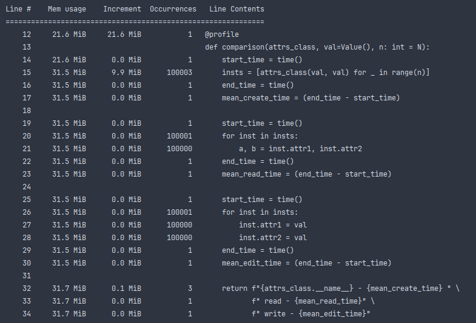
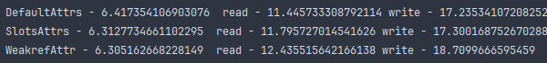

## Использование памяти

### Обычные аттрибуты

### Слоты

### Weakref

### Вывод
Слоты используют примерно в 3 раза меньше памяти чем обычные аттрибуты. 
Weakref, в свою очередь, использует памяти в 2 раза больше чем слоты 
и в 1.5 памяти меньше, чем обычные атрибуты.

## Время

### Вывод
Weakref`у нужно намного больше времени на чтение и на запись чем слотам и обычным аргументам.
Слоты выигрывают по времени у обычных аттрибутов.